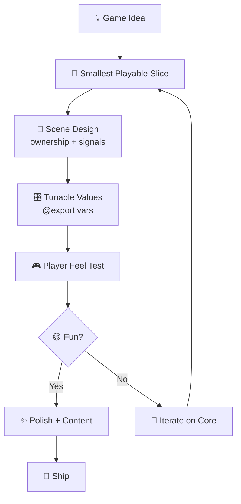
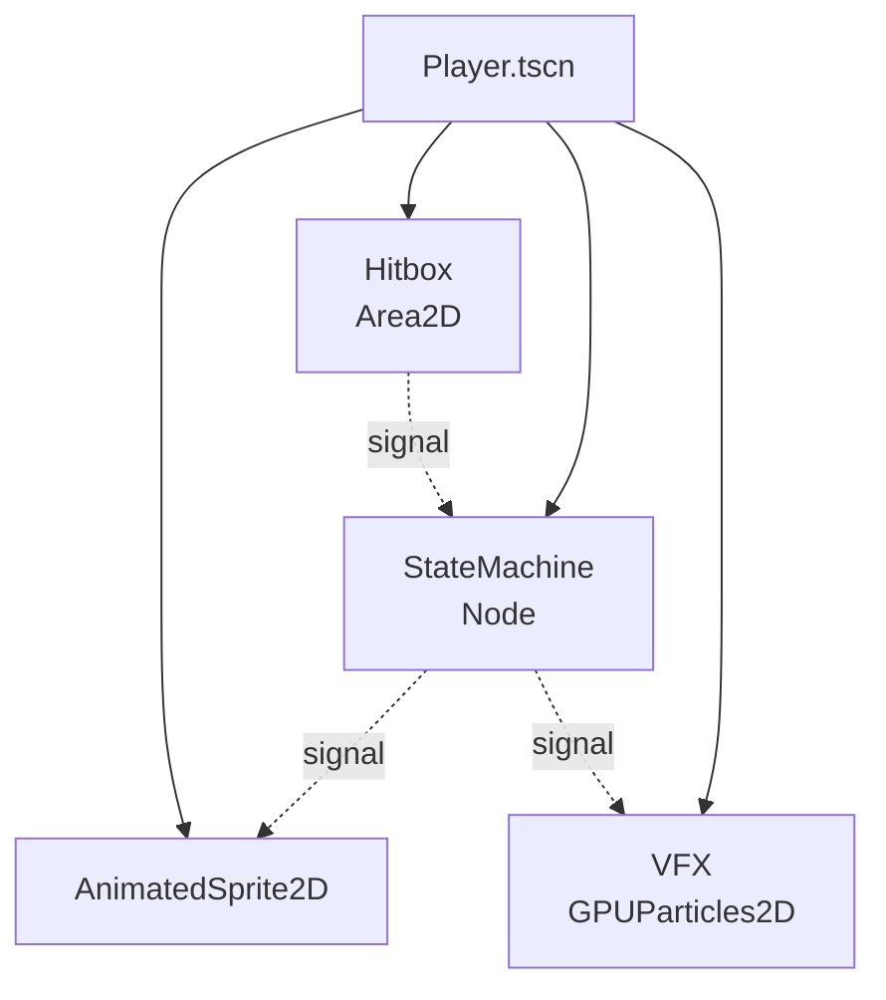

# craft-godot-designer

A CRAFT harness for Godot 4 game design and architecture.

## Philosophy

> "Shippable gameplay over perfect architecture."

This cartridge prioritizes player feel, fast iteration, and Godot-idiomatic patterns. Scene trees should be clear, signals decoupled, and gameplay data tunable without code changes.

## Usage

Install via CRAFT CLI:
```bash
craft harness install github:Rosavera-I/craft-godot-designer
```

Compose with other harnesses:
```bash
craft compose godot-designer tdd-architect -o craft.compose.toml
craft run craft.compose.toml --prompt "Design a ranged enemy AI"
```

## Design Workflow



## Scene Architecture



## Memory Schema

| Fact | Purpose |
|------|---------|
| `project_engine` | Godot version and renderer |
| `godot_executable` | Editor, CLI, and headless command |
| `gameplay_loop` | Core loop: verbs, goals, rewards |
| `project_structure` | Scenes, scripts, resources, autoloads |
| `scene_patterns` | Ownership, signals, composition |
| `node_naming_convention` | Node naming style |
| `state_machine_pattern` | Enum, match, or child-node states |
| `physics_layer` | Collision layers and masks |
| `resource_patterns` | Custom Resources and `.tres` data |
| `tuning_values` | Exported gameplay constants |
| `autoloads` | Global singletons |
| `input_map` | Actions and bindings |
| `performance_budget` | FPS targets, node limits |
| `asset_pipeline` | Import settings, naming |

## Godot Patterns

### ✅ Do
```gdscript
# Signal-driven communication
signal health_changed(new_health)

@export var max_health: int = 100
@onready var health: int = max_health

func take_damage(amount: int) -> void:
    health = clamp(health - amount, 0, max_health)
    health_changed.emit(health)
```

### ❌ Don't
```gdscript
# Brittle node paths
get_node("../../../Player").health -= amount

# Hard-coded values
var speed = 300  # Can't tune without code change

# Deep inheritance hierarchy
class_name Entity -> Character -> Player -> Warrior
```

## Validation Checks

**Must have:**
- `mentions_scene_or_script_path` — Specific files, not vague advice
- `includes_small_next_step` — Actionable next task
- `references_signal_connection` — Signal-based decoupling
- `notes_tunable_parameter` — Export values for design iteration
- `considers_player_feel` — Input response, feedback, juice

**Anti-patterns forbidden:**
- `rewrites_entire_game_architecture` — Big bang redesigns
- `unity_style_inheritance_heavy_design` — Wrong engine mindset
- `brittle_node_paths_without_signals` — Tight coupling
- `premature_optimization_before_fun` — Optimize after fun is proven
- `deep_scene_hierarchies` — Performance and readability issues
- `untyped_public_apis` — Type hints for maintainability

## Example Session

```bash
$ craft run godot-designer --prompt "Design a dash mechanic"

🌳 Scene Design:
- Player.tscn: Add DashState node sibling to MoveState
- Connect to StateMachine signal: transition_requested

🎛️ Tunable Values:
@export var dash_speed: float = 800.0
@export var dash_duration: float = 0.15
@export var dash_cooldown: float = 0.5
@export var dash_iframes: bool = true

🎮 Player Feel:
- Immediate response on input
- Ghost trail effect during dash
- Screen shake on dash end
- Coyote time: 0.1s buffer after leaving platform

📁 Files:
- src/player/states/dash_state.gd
- src/player/components/dash_trail.tscn

🎯 Next Step:
Implement DashState extending State, handle physics_process
```

## License

MIT
